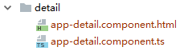
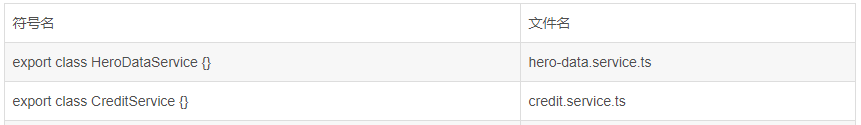

## 目录
把应用程序的启动源代码都放到名叫 app 的目录里，其余的页面内容放在page目录中。所有内容都遵循每个文件单个特性的原则。每个组件、服务和管道都在自己的文件里。所有第三方程序包都被保存到其它目录里而不在 app 目录里，我们不会修改它们，所以不希望它们弄乱我们的应用程序。使用本指南介绍的文件命名约定。

#### 尽可能保持平面化的目录结构

------------
1. 为每个组件新建一个目录，保存它的 .ts,.html,.css,.spec 等文件；  
1. 把目录的名字命名为它包含的特性名字；

把模板和样式提取到它们自己的文件
------------

1. 当模板和样式内容超过三行的时候，把模板和样式提取到一个单独的文件
1. 当组件名字为 [component-name] 的时候，命名它的模板为 [component-name].component.html

文件
------------


每个文件只定义一样东西 (比如服务或者组件 )，把文件大小限制在 400行代码以内；

定义小函数，限制在 75 行之内；

遵循同一个模式来描述符号的特性和类型。推荐的模式为 feature.type.ts，使用惯用的后缀来描述类型，比如 *.service 、 *.component 、 *.pipe、*.model；

在描述性名字里面，使用横杠来分隔单词，如：visit-track.compomemt.html；


组件与指令命名
------------


以它们所代表的东西命名;

使用大写驼峰命名法来命名所有符号 ( 类 ) ：**export class HeroesComponent**
保持符号的名字与它所在的文件名字相同：**heroes.component.ts**;

把符号的类型 ( 比如组件、服务、指令等 ) 附加到符号名的后面：
	**export class ValidationDirective
	validation.directive.ts**

服务
------------


使用大写驼峰命名法来命名服务；

当不能从它们的名字里清楚的看出它们是什么的时候 ( 比如它们的名字是名词时 ) ，添加 Service 后缀；

如下所示：  


指令的选择器
------------


使用小驼峰命名法来命名指令的选择器，Angular 2 HTML 解析器是大小写敏感的，它识别小写驼峰写法；

保持指令里定义的属性名字与它们绑定的视图 HTML 属性名字一致；

为组件的选择器使用自定义前缀。比如，前缀 tod 是从 Tour of Heros 来的，前缀 admin 代表了 admin 的特性区域；

使用前缀来识别特性区域或者应用程序本身；

如下所示

    @Component({
     selector: 'admin-users'
    })
    export class UsersComponent {}
    
    @Directive({
     selector: '[tohValidate]'
    })
    export class ValidateDirective {}

 管道名
------------


为所有管道使用前后一致的命名约定，用它们的特性来命名；

如下：

```javascript
@Pipe({ name: 'ellipsis' })

export class EllipsisPipe implementsPipeTransform { }
```

编程约定
------------


##### 类
> 使用大写驼峰命名法来命名类；


    export class ExceptionService {    
     constructor() { }    
    }

##### 常量

> 用 const 声明变量，除非它们的值在应用的生命周期内会发生变化；
> 把常量名拼写为小驼峰格式；把常量名拼写为小驼峰格式；


    export const mockHeroes   = ['Sam', 'Jill'];
 

##### 属性和方法
> 使用小写驼峰命名法来命名属性和方法；
> 避免使用下划线为前缀来命名私有属性和方法；


    import { Injectable } from '@angular/core';
    
    @Injectable()    
    export class ToastService {
    
     message: string;    
     private toastCount: number;
    
     hide() {    
       this.toastCount--;    
       this.log();    
      }
    
     show() {    
       this.toastCount++;    
       this.log();    
      }
    
     private log() {    
       console.log(this.message);   
      }
    
    }

##### 内联 Input 和 Output 属性装饰器
> 使用 @Input 和 @Output, 而非 @Directive 和 @Component 装饰器里面的 inputs 和 outputs 属性；
> 把 @Input() 或者 @Output() 放到它们装饰的属性的同一行；  

    @Output() deleteRequest = new EventEmitter();
    @Input() heroess: Hero[];
##### 成员顺序
> 把属性成员放到顶部，方法成员紧随其后；
> 先放公共成员，再放私有成员，并按照字母顺序排列；


    export class ToastComponent implementsOnInit {
    
      //public properties
     message: string;
     title: string;
    
      //private fields
      private defaults = {
       title: '',
       message: 'May the Force be with You'
      };
      private toastElement: any;
    
      //public methods
    
     activate(message = this.defaults.message, title = this.defaults.title) {
       this.title = title;
       this.message = message;
       this.show();
      }
    
     ngOnInit() {
       this.toastElement = document.getElementById('toh-toast');
      }
    
      //private methods
    
     private hide() {
       this.toastElement.style.opacity = 0;
       window.setTimeout(() => this.toastElement.style.zIndex = 0, 400);
      }
    
     private show() {
       console.log(this.message);
       this.toastElement.style.opacity = 1;
       this.toastElement.style.zIndex = 9999;
       window.setTimeout(() => this.hide(), 2500);
      }
    
    }

##### 把逻辑放到服务里
> 把组件类中的逻辑限制到只有视图需要的逻辑。所有其它逻辑都应该被放到服务；
把可以重复使用的逻辑放到服务里，保持组件简单并聚焦于它们预期目的；

错误的方式


    /* avoid */
    
    import { OnInit } from '@angular/core';
    import { Http, Response } from'@angular/http';
    import { Observable } from'rxjs/Observable';
    import { Hero } from'../shared/hero.model';
    
    const heroesUrl = 'http://angular.io';
    export class HeroListComponent implementsOnInit {
     heroes: Hero[];
     constructor(private http: Http) {}
     getHeroes() {
       this.heroes = [];
       this.http.get(heroesUrl)
         .map((response: Response) => <Hero[]>response.json().data)
         .catch(this.catchBadResponse)
         .finally(() => this.hideSpinner())
         .subscribe((heroes: Hero[]) => this.heroes = heroes);
      }
     ngOnInit() {
       this.getHeroes();
      }
    
     private catchBadResponse(err: any, source: Observable<any>) {
       // log and handle the exception
       return new Observable();
      }
    
     private hideSpinner() {
       // hide the spinner
      }
    }
    
正确的方式


    import { Component, OnInit } from'@angular/core';
    import { Hero, HeroService } from'../shared';
    
    @Component({
     selector: 'toh-hero-list',
     template: `...`
    })
    
    export class HeroListComponent implementsOnInit {
     heroes: Hero[];
     constructor(private heroService: HeroService) {}
     getHeroes() {
       this.heroes = [];
       this.heroService.getHeroes()
         .subscribe(heroes => this.heroes = heroes);
      }
    
     ngOnInit() {
       this.getHeroes();
      }
    }

##### 使用指令来加强已有元素
> 当你需要有无模板的展示逻辑时，使用属性型指令。


    @Directive({
     selector: '[tohHighlight]'
    })
    
    export class HighlightDirective {
     @HostListener('mouseover') onMouseEnter() {
       // do highlight work
      }
    }
    
    <divtohHighlight>Bombasta</div>


##### 服务
> 在同一个注入器内，服务是单例
在同一个注入器内，把服务当做单例使用。使用它们来共享数据和功能。


    export class HeroService {
     constructor(private http: Http) { }
    
     getHeroes() {
       return this.http.get('api/heroes')
         .map((response: Response) => <Hero[]>response.json().data);
      }
    }

##### 单一职责
> 新建单一职责的服务，把它封装在自己的环境内；
当服务成长到超出单一用途时，新建一个服务；

##### 数据服务
> 分离数据调用
把数据操作和数据互动重构到服务里；
让数据服务来负责 XHR 调用、本地储存、内存储存或者其他数据操作；

##### 生命周期钩子
> 实现生命周期钩子接口，避免在方法名字拼写错误时，造成无意间没有调用钩子的可能。


    @Component({
     selector: 'toh-hero-button',
     template: `<button>OK</button>`
    })
    
    export class HeroButtonComponent implementsOnInit {
    
     ngOnInit() {
       console.log('The component is initialized');
      }
    }
